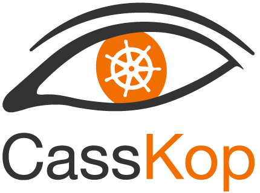

# CassKop - Cassandra Kubernetes operator

[](https://circleci.com/gh/Orange-OpenSource/casskop) [](https://sonarcloud.io/dashboard?id=Orange-OpenSource_cassandra-k8s-operator)


## Project overview

The CassKop Cassandra Kubernetes operator makes it easy to run Apache Cassandra on Kubernetes. Apache Cassandra is a popular, 
free, open-source, distributed wide column store, NoSQL database management system. 
The operator allows to easily create and manage racks and data centers aware Cassandra clusters.

The Cassandra operator is based on the CoreOS
[operator-sdk](https://github.com/operator-framework/operator-sdk) tools and APIs.

> **NOTE**: This is an alpha-status project. We do regular tests on the code and functionality, but we can not assure a
> production-ready stability at this time.
> Our goal is to make it run in production as quickly as possible.


CassKop creates/configures/manages Cassandra clusters atop Kubernetes and is by default **space-scoped** which means
that :
- CassKop is able to manage X Cassandra clusters in one Kubernetes namespace.
- You need X instances of CassKop to manage Y Cassandra clusters in X different namespaces (1 instance of CassKop
  per namespace).

> This adds security between namespaces with a better isolation, and less work for each operator.

## CassKop presentation

We have some slides for a [CassKop demo](https://orange-opensource.github.io/casskop/slides/index.html?slides=Slides-CassKop-demo.md#1)

You can also play with CassKop on [Katacoda](https://www.katacoda.com/orange)

## CassKop features


CassKop deals with Cassandra clusters on one datacenter. For multi-dacenters deployments, please use [MultiCassKop](multi-casskop/Readme.md) in addition to CassKop. This second operator is part of this same repository.

The following features are supported by CassKop:
- [x] Deployment of a C* cluster (rack or AZ aware)
- [x] Scaling up the cluster (with cleanup)
- [x] Scaling down the cluster (with decommission prior to Kubernetes scale down)
- [x] Pods operations (removenode, upgradesstable, cleanup, rebuild..)
- [x] Adding a Cassandra DC
- [x] Removing a Cassandra DC
- [x] Setting and modifying configuration files
- [x] Setting and modifying configuration parameters
- [x] Update of the Cassandra docker image
- [x] Rolling update of a Cassandra cluster
    - [x] Update of Cassandra version (including upgradesstable in case of major upgrade)
    - [x] Update of JVM
    - [x] Update of configuration
- [x] Rolling restart of a Cassandra rack
- [x] Stopping a Kubernetes node for maintenance
    - [x] Process a remove node (and create new Cassandra node on another Kubernetes node)
    - [x] Process a replace address (of the old Cassandra node on another Kubernetes node)
- [x] Manage operations on pods through CassKop plugin (cleanup, rebuild, upgradesstable, removenode..)
- [x] Monitoring (using Instaclustr Prometheus exporter to Prometheus/Grafana)
- [x] Use official Cassandra Image (configuration for Casskop is done through a bootstrap init-container)
- [ ] Performing live backup of Cassandra datas (using Instaclustr sidecar)
- [ ] Performing live restore of datas (using Instaclustr sidecar)
- [x] Performing live Cassandra repairs through the use of [Cassandra reaper](http://cassandra-reaper.io/)
- [x] Pause/Restart & rolling restart operations through CassKoP plugin.

> CassKop doesn't use nodetool but invokes operations through authenticated JMX/Jolokia call


## Pre-requisites

### For developers

Operator SDK is part of the operator framework provided by RedHat & CoreOS. The goal 
is to provide high-level abstractions that simplifies creating Kubernetes operators.

The quick start guide walks through the process of building the Cassandra operator 
using the SDK CLI, setting up the RBAC, deploying the operator and creating a 
Cassandra cluster.

You can find this in the [Developer section](documentation/development.md)

### For users

Users should only need Kubectl & helm cli

- [kubectl](https://kubernetes.io/docs/tasks/tools/install-kubectl/) version v1.13.3+.
- [Helm](https://helm.sh/) version v2.12.2+.
- Access to a Kubernetes v1.13.3+ cluster.
- Cassandra needs fast local storage (we have tested with local storage
  provisioner, GKE ssd storage, and Rancher local-path-provisioner)

#### Install CassKop kubectl plugin

You can install the plugin by copying the [file](plugins/kubectl-casskop) into your PATH.


## Build pipelines

We uses CircleCI as our CI tool to build and test the operator.

### Build image

To accelerate build phases we have created a custom [build-image](docker/circleci/Dockerfile) used by the CircleCI pipeline:

https://cloud.docker.com/u/orangeopensource/repository/docker/orangeopensource/casskop-build

You can find more info in the [developer Section](documentation/development.md)

### Cassandra operator

The Cassandra operator image is automatically built and stored on [Docker Hub](https://cloud.docker.com/u/orangeopensource/repository/docker/orangeopensource/casskop)

[](https://circleci.com/gh/Orange-OpenSource/casskop)

Casskop uses standard Cassandra image (tested up to Version 3.11)


## Deploy the Cassandra operator in the cluster

First, we need to create a Kubernetes `namespace` in order to host our operator & cluster

```
kubectl create namespace cassandra
```

### Deploy the Cassandra Operator and it's CRD with Helm

To ease the use of the Cassandra operator, a [Helm](https://helm.sh/) chart has been 
created

> We are looking where to store our helm in the future

> ##### Helm 2 users
>
> If it is the 1rst time you deploy a chart with [Helm](https://helm.sh/), you may need to [install](https://helm.sh/docs/install/) the helm client and tiller, and create the service account for tiller (more informations about how to create a tiller service account [here](https://docs.bitnami.com/kubernetes/how-to/configure-rbac-in-your-kubernetes-cluster/#use-case-2-enable-helm-in-your-cluster).
>
> ```
> helm init --history-max 200
> kubectl create serviceaccount tiller --namespace kube-system
> kubectl create -f tiller-clusterrolebinding.yaml
> helm init --service-account tiller --upgrade
> ```

> ##### Helm 3 users
>
> You will need to manually install the crds beforehand
>
> ```console
> kubectl apply -f https://raw.githubusercontent.com/Orange-OpenSource/casskop/master/deploy/crds/db.orange.com_cassandraclusters_crd.yaml
> ```

Add the Helm incubator repo if you do not already have it:

```
helm repo add orange-incubator https://orange-kubernetes-charts-incubator.storage.googleapis.com
```

Get the latest information about charts from the chart repositories.

```
helm repo update
helm install --name casskop orange-incubator/cassandra-operator
```


> ##### Helm 3 users
>
> Remove --name from the command

Deploy CassKop:

```console
$ helm install --name casskop orange-incubator/cassandra-operator
NAME:   casskop
LAST DEPLOYED: Thu May 23 15:34:27 2019
NAMESPACE: cassandra-demo
STATUS: DEPLOYED

RESOURCES:
==> v1/ServiceAccount
NAME                    SECRETS  AGE
casskop  1        0s

==> v1beta1/Role
NAME                    AGE
casskop  0s

==> v1/RoleBinding
NAME                    AGE
casskop  0s

==> v1/Deployment
NAME                            DESIRED  CURRENT  UP-TO-DATE  AVAILABLE  AGE
casskop-casskop  1        1        1           0          0s

==> v1/Pod(related)
NAME                                            READY  STATUS             RESTARTS  AGE
casskop-casskop-78786b9bf-cjggg  0/1    ContainerCreating  0
0s
```

> You can find more information in the [Cassandra operator Helm readme](helm/casskop/readme.md)

> If you have problem you can see [troubleshooting](helm/cassandra-operator/readme.md#Troubleshooting) section


This creates a Kubernetes Deployment for the operator, with RBAC settings.

Once deployed, you may find the Pods created by the Charts. If you deploy a release
named `casskop`, then your pod will have a name similar to :

```
$ kubectl get pod
NAME                                 READY     STATUS    RESTARTS   AGE
casskop-cassandra-operator-78786b9bf-cjggg   1/1       Running   0          1h
```

You can view the CassKop logs using 

```
$ kubectl logs -f cassandra-cassandra-operator-78786b9bf-cjggg
```

The charts also deploy the cassandracluster CRD we can check that it is deployed:

```
$ kubectl get crd
NAME                              AGE
...
cassandraclusters.db.orange.com   1h
...
```

## Deploy a ConfigMap

Before we can deploy our cluster, we need to create a configmap.
This configmap will enable us to customize Cassandra's behaviour.
More details on this can be found [here](documentation/description.md#configuration-override-using-configmap)

But for our example we will use the simple example: 
```
kubectl apply -f samples/cassandra-configmap-v1.yaml
```

## Deploy a Cassandra cluster

Once the operator is deployed inside a Kubernetes cluster, a new API will be accessible, so 
you'll be able to create, update and delete cassandraclusters.


In order to deploy a new cassandra cluster a [specification](samples/cassandracluster.yaml) has to be created. As an example :

```
kubectl apply -f samples/cassandracluster.yaml
```

See pods coming to life :

```
kubectl get pods -w
```

You can watch the status updates in real time on your CassandraCluster object :

```
watch 'kubectl describe cassandracluster cassandra-demo | tail -20'
```

## Cassandra cluster status

You can find mode information on the `CassandraCluster.status` in [this section](documentation/description.md#cassandracluster-status)

<!--
If you need mode information you can check the [algorithm](documentation/algorithms.md) page
-->

## Make operation on the cluster

You can do a lot of [operations](documentation/operations.md) on your Cassandra cluster.

## Cassandra operator recovery

If the Cassandra operator restarts, it can recover its previous state thanks to the CRD objects 
`CassandraClusters` which stored directly in Kubernetes, description and state of the Cassandra cluster.

## Upgrading the operator (no changes of the CRD's structure)

Upgrading the operator consists in uninstalling the current version and installing the new version :
```
helm uninstall casskop
helm repo update
helm install --name casskop casskop/cassandra-operator
```

It's also possible to decide to temporarily install a developement release by specifying the image tag to use :
```
helm install --name casskop casskop/cassandra-operator --set debug.enabled=true --no-hooks \
--set image.tag=v0.5.0b-branch1
```

### Upgrade Casskop 0.1.5+/Bootstrap image to 0.1.4

:triangular_flag_on_post: We made a few breaking changes in that image:

- ready-probe.sh was renamed to readiness-probe.sh
- /opt/bin contains the curl command to query Jolokia

Because of it upgrading casskop from 0.5.0 to 0.5.1+ requires to the following steps:

- Uninstall casskop (`helm delete casskop`)
- Edit all statefulsets to manually make those few changes using kubectl edit statefulsets $name-of-your-statefulset
  * Rename ready-probe.sh to readiness-probe.sh
  * Upgrade the bootstrap image to 0.1.4+
  * Add a new emptyDir in the volumes section
  ```
        volumes:
        - emptyDir: {}
        name: tools
        ....
  ```
  * Mount that new volume in all initcontainers and containers (:bulb: init-config does not really need it, but we need to change it first in the operator #189)
  ```
        name: init-config
        ....
        volumeMounts:
        - mountPath: /opt/bin
          name: tools
        ....
        name: bootstrap
        ....
        volumeMounts:
        - mountPath: /opt/bin
          name: tools
        ....
        name: cassandra
        ...
        volumeMounts:
        - mountPath: /opt/bin
          name: tools
        ....
  ```
- Upgrade the version bootstrap image in your cassandracluster object (kubectl edit cassandraclusters *YOUR_OBJECT*)
- Install new version of casskop

## Uninstaling the Charts

If you want to delete the operator from your Kubernetes cluster, the operator deployment 
should be deleted.

```
$ helm delete casskop
```
The command removes all the Kubernetes components associated with the chart and deletes the helm release.

> The CRD created by the chart are not removed by default and should be manually cleaned up (if required)

Manually delete the CRD:
```
kubectl delete crd cassandraclusters.dfy.orange.com
```

> :triangular_flag_on_post: If you delete the CRD then it will delete **ALL** Clusters that has been created using this CRD!!!
> Please never delete a CRD without very very good care

### Operator SDK

CassKop is build using operator SDK:

- [operator-sdk](https://github.com/operator-framework/operator-sdk)
- [operator-lifecycle-manager](https://github.com/operator-framework/operator-lifecycle-manager)

### Monitoring

We can quickly setup monitoring for our deployed Cassandra nodes using
Prometheus operator.

#### Deploy Prometheus

You can deploy the CoreOs Prometheus operator on your cluster:
You can find example [helm value.yaml](samples/prometheus-values.yaml) to configure the Prometheus operator:

```console
$ kubectl create namespace monitoring
$ helm install --namespace monitoring --name prometheus stable/prometheus-operator
```

#### Add ServiceMonitor for Cassandra

Then you have to define a ServiceMonitor object to monitor
cluster deployed by your cassandra operator (one time), update this to specify which namespace to monitor.

cassandra-service-monitor.yml
```yaml
apiVersion: monitoring.coreos.com/v1
kind: ServiceMonitor
metadata:
  name: kube-prometheus-cassandra-k8s-jmx
  labels:
    k8s-apps: cassandra-k8s-jmx
    prometheus: kube-prometheus
    component: cassandra
    release: prometheus
spec:
  jobLabel: kube-prometheus-cassandra-k8s-jmx
  selector:
    matchLabels:
      k8s-app: exporter-cassandra-jmx
  namespaceSelector:
      matchNames:
      - cassandra
      - cassandra-demo
      - default
  endpoints:
  - port: promjmx
    interval: 15s
```

Your namespace need to be listed in the `namespaceSelector` section.

#### Add Grafana dashboard for Cassandra

You can import this [dashboard](samples/prometheus-grafana-cassandra-dashboard.json) to retrieve metrics about your Cassandra cluster.

# Contributing

See [CONTRIBUTING](CONTRIBUTING.md) for details on submitting patches and the contribution workflow.

# Contacts

You can contact the team with our mailing-list prj.casskop.support@list.orangeportails.net and join our slack https://casskop.slack.com (request sent to that ML)

# License

CassKop is under Apache 2.0 license. See the [LICENSE](LICENSE) file for details.