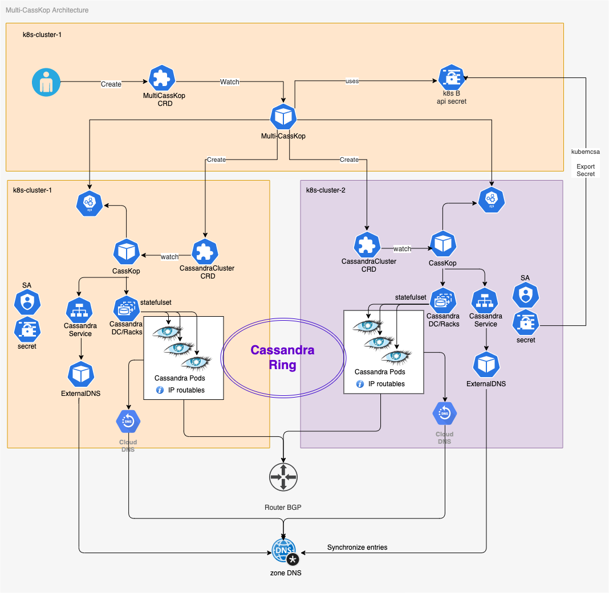

# Multi-CassKop Project

<!-- markdown-toc start - Don't edit this section. Run M-x markdown-toc-refresh-toc -->
**Table of Contents**

- [Multi-CassKop Project](#multi-casskop-project)
    - [Pre-requisite](#pre-requisite)
        - [Bootstrap API access to k8s-cluster-2 from k8s-cluster-1](#bootstrap-api-access-to-k8s-cluster-2-from-k8s-cluster-1)
        - [Install Multi-CassKop](#install-multi-casskop)
        - [Create the MultiCassKop CRD](#create-the-multicasskop-crd)
        - [Install CassKop](#install-casskop)
        - [Install External-DNS](#install-external-dns)

<!-- markdown-toc end -->


## Intro

CassKop introduces a new Custom Resource Definition, `CassandraCluster` which allows you to describe the Cassandra cluster you want to deploy.
This works fine within a single Kubernetes cluster, and can allow for instance to deploy Cassandra in a mono-region multi-AZ topology.

But for having more resilience with our Cassandra cluster, we want to be able to spread it on several regions. For doing this with Kubernetes, we need that our Cassandra to spread spread on top of different Kubernetes clusters, deployed independently on different regions.

We introduce [MultiCassKop](https://github.com/Orange-OpenSource/casskop/multi-casskop) a new operator that fits above CassKop. MultiCassKop is a new controler that will be in charge of creating `CassandraClusters` CRD objects in several different Kubernetes clusters and in a manner that all Cassandra nodes will be part of the same ring.

MultiCassKop uses a new custom resource definition, `MultiCasskop` which allows to specify:
- a base for the CassandraCluster object
- an override of this base object for each kubernetes cluster we want to deploy on.

Recap:
Multi-CassKop goal is to bring the ability to deploy a Cassandra cluster within different regions, each of them running
an independant Kubernetes cluster.
Multi-Casskop insure that the Cassandra nodes deployed by each local CassKop will be part of the same Cassandra ring by
managing a coherent creation of CassandraCluster objects from it's own MultiCasskop custom ressource.


## Pre-requisite

In order to have a working Multi-CassKop operator we need to have at least 2 k8s clusters: k8s-cluster-1 and k8s-cluster-2

- k8s >=v1.15 installed on each site, with kubectl configure to access both of thems
- The pods of each site must be able to reach pods on other sites, this is outside of the scope of Multi-Casskop and can
  be achieve by different solutions such as:
  - in our on-premise cluster, we leverage [Calico](https://www.projectcalico.org/why-bgp/) routable IP pool in order to make this possible
  - this can also be done using mesh service such as istio
  - there may be other solutions as well
- having casskop installed (With its ConfigMap) in each namespace see [CassKop installation](#install-casskop)
- having [External-DNS](https://github.com/kubernetes-sigs/external-dns) with RFC2136 installed in each namespace to
  manage your DNS sub zone. see [Install external dns](#install-external-dns)
- You need to create secrets from targeted k8s clusters in current. see[Bootstrap](#bootstrap-api-access-to-k8s-cluster-2-from-k8s-cluster-1)
- You may need to create network policies for Multi-Casskop inter-site communications to k8s apis, if using so.

> /!\ We have only tested t/.he configuration with Calico routable IP pool & external DNS with RFC2136 configuration.

### Bootstrap API access to k8s-cluster-2 from k8s-cluster-1

Multi-Casskop will be deployed in k8s-cluster-1, change your kubectl context to point to this cluster.

In order to allow our Multi-CassKop controller to have access to k8s-cluster-2 from k8s-cluster-1, we are going to use
[kubemcsa](https://github.com/admiraltyio/multicluster-service-account/releases/tag/v0.6.1) from
[Admiralty](https://admiralty.io/) to be able to export secret from k8s-cluster-2 to k8s-cluster1

```
kubemcsa export --context=cluster2 --namespace cassandra-e2e cassandra-operator --as k8s-cluster2 | kubectl apply -f -
```

> This will create in current k8s cluster which must be k8s-cluster-1, the k8s secret associated to the
> **cassandra-operator** service account of namespace **cassandra-e2e** in k8s-cluster2.
> /!\ The Secret will be created with the name **k8s-cluster2** and this name must be used when starting Multi-CassKop and
> in the MultiuCssKop CRD definition see below

This Diagram show how each component is connected:




MultiCassKop starts by iterrating on every contexts passed in parameters then it register the controller. 
The controller needs to be able to interract with MultiCasskop and CassandraCluster CRD objetcs.
In addition the controller needs to watch for MultiCasskop as it will need to react on any changes that occured on
thoses objects for the given namespace.

### Install CassKop

CassKop must be deployed on each targeted Kubernetes clusters.

Add the Helm repository for CassKop

```console
$ helm repo add orange-incubator https://orange-charts-incubator.storage.googleapis.com
$ helm repo update
```

Connect to each kubernetes you want to deploy your Cassandra clusters to and install CassKop:

```console
$ helm install --name casskop orange-incubator/cassandra-operator
```

### Install External-DNS

[External-DNS](https://github.com/kubernetes-sigs/external-dns) must be installed in each Kubernetes clusters.
Configure your external DNS with a custom values pointing to your zone and deploy it in your namespace 

```console
helm install -f /private/externaldns-values.yaml --name casskop-dns external-dns 
```

### Install Multi-CassKop

Proceed with Multi-CassKop installation only when [Pre-requisites](#pre-requisites) are fulfilled.

Deployment with Helm. Multi-CassKop and CassKop shared the same github/helm repo and semantic version.

```
helm install --name multi-casskop orange-incubator/multi-casskop --set k8s.local=k8s-cluster1 --set k8s.remote={k8s-cluster2}
```

> if you get an error complaining that the CRD already exists, then replay it with `--no-hooks`

When starting Multi-CassKop, we need to give some parameters:
- k8s.local is the name of the k8s-cluster we want to refere to when talking to this cluster.
- k8s.remote is a list of other kubernetes we want to connect to.

> Names used there should map with the name used in the MultiCassKop CRD definition)
> the Names in `k8s.remote` must match the names of the secret exported with the [kubemcsa](#bootstrap-api-access-to-k8s-cluster-2-from-k8s-cluster-1) command

When starting, our MultiCassKop controller should log something similar to:

```
time="2019-11-28T14:51:57Z" level=info msg="Configuring Client 1 for local cluster k8s-cluster1 (first in arg list). using local k8s api access"
time="2019-11-28T14:51:57Z" level=info msg="Configuring Client 2 for distant cluster k8s-cluster2. using imported secret of same name"
time="2019-11-28T14:51:57Z" level=info msg="Creating Controller"
time="2019-11-28T14:51:57Z" level=info msg="Create Client 1 for Cluster k8s-cluster1"
time="2019-11-28T14:51:57Z" level=info msg="Add CRDs to Cluster k8s-cluster1 Scheme"
time="2019-11-28T14:51:57Z" level=info msg="Create Client 2 for Cluster k8s-cluster2"
time="2019-11-28T14:51:58Z" level=info msg="Add CRDs to Cluster k8s-cluster2 Scheme"
time="2019-11-28T14:51:58Z" level=info msg="Configuring Watch for MultiCasskop"
time="2019-11-28T14:51:58Z" level=info msg="Configuring Watch for MultiCasskop"
time="2019-11-28T14:51:58Z" level=info msg="Writing ready file."
time="2019-11-28T14:51:58Z" level=info msg="Starting Manager."
```

We see it successfully created a k8s client for each of our cluster.
Then it do nothing, it is waiting for MultiCassKop objects.

### Create the MultiCassKop CRD

You can deploy a MultiCassKop CRD instance.

You can find an example in the `multi-casskop/samples/multi-casskop.yaml` file:

this is the structure of the file:

```yaml
apiVersion: db.orange.com/v1alpha1
kind: MultiCasskop
metadata:
  name: multi-casskop-e2e
spec:
  # Add fields here
  deleteCassandraCluster: true
  base:
    <The base of the CassandraCluster object you want Multi-CassKop to create>
    ...
    status: #<!!-- At this time the seedlist must be provided Manually. we know in advance the domain name
            # it's the <pod-name>.<your-external-dns-domain>
      seedlist:
        - cassandra-e2e-dc1-rack1-0.my.zone.dns.net
        - cassandra-e2e-dc1-rack1-1.my.zone.dns.net
        - cassandra-e2e-dc2-rack4-0.my.zone.dns.net
        - cassandra-e2e-dc2-rack4-1.my.zone.dns.net      
  override:
    k8s-cluster1: #<!!-- here is the name which must correspond to the helm argument `k8s.local`
      spec: #<-- Here we defined overrides part for the CassandraCluster for the k8s-cluster1
        pod:
          annotations:
            cni.projectcalico.org/ipv4pools: '["routable"]' #<!-- If using external DNS, change with your current zone
        topology:
          dc:
          ...
    k8s-cluster2: #<!!-- here is the name which must correspond to the helm argument `k8s.remote`
      spec:
        pod:
          annotations:
            cni.projectcalico.org/ipv4pools: '["routable"]' #<!-- If using external DNS, change with your current zone
        imagepullpolicy: IfNotPresent
        topology:
          dc:
          ...
```

You can create the Cluster with :

```
k apply -f multi-casskop/samples/multi-casskop.yaml
```

Then you can see the MultiCassKop logs:

```
time="2019-11-28T15:46:19Z" level=info msg="Just Update CassandraCluster, returning for now.." cluster=cassandra-e2e kubernetes=k8s-cluster1 namespace=cassandra-e2e
time="2019-11-28T15:46:19Z" level=info msg="Cluster is not Ready, we requeue [phase= / action= / status=]" cluster=cassandra-e2e kubernetes=k8s-cluster1 namespace=cassandra-e2e
time="2019-11-28T15:46:49Z" level=info msg="Cluster is not Ready, we requeue [phase=Initializing / action=Initializing / status=Ongoing]" cluster=cassandra-e2e kubernetes=k8s-cluster1 namespace=cassandra-e2e
time="2019-11-28T15:47:19Z" level=info msg="Cluster is not Ready, we requeue [phase=Initializing / action=Initializing / status=Ongoing]" cluster=cassandra-e2e kubernetes=k8s-cluster1 namespace=cassandra-e2e
time="2019-11-28T15:47:49Z" level=info msg="Cluster is not Ready, we requeue [phase=Initializing / action=Initializing /status=Ongoing]" cluster=cassandra-e2e kubernetes=k8s-cluster1 namespace=cassandra-e2e
time="2019-11-28T15:47:19Z" level=info msg="Cluster is not Ready, we requeue [phase=Initializing / action=Initializing / status=Ongoing]" cluster=cassandra-e2e kubernetes=k8s-cluster1 namespace=cassandra-e2e
time="2019-11-28T15:47:49Z" level=info msg="Cluster is not Ready, we requeue [phase=Initializing / action=Initializing / status=Ongoing]" cluster=cassandra-e2e kubernetes=k8s-cluster1 namespace=cassandra-e2e
time="2019-11-28T15:48:19Z" level=info msg="Cluster is not Ready, we requeue [phase=Initializing / action=Initializing / status=Ongoing]" cluster=cassandra-e2e kubernetes=k8s-cluster1 namespace=cassandra-e2e
time="2019-11-28T15:48:49Z" level=info msg="Cluster is not Ready, we requeue [phase=Initializing / action=Initializing / status=Ongoing]" cluster=cassandra-e2e kubernetes=k8s-cluster1 namespace=cassandra-e2e
time="2019-11-28T15:49:19Z" level=info msg="Just Update CassandraCluster, returning for now.." cluster=cassandra-e2e kubernetes=k8s-cluster2 namespace=cassandra-e2e
time="2019-11-28T15:49:49Z" level=info msg="Cluster is not Ready, we requeue [phase=Initializing / action=Initializing / status=Ongoing]" cluster=cassandra-e2e kubernetes=k8s-cluster2 namespace=cassandra-e2e
time="2019-11-28T15:50:19Z" level=info msg="Cluster is not Ready, we requeue [phase=Initializing / action=Initializing / status=Ongoing]" cluster=cassandra-e2e kubernetes=k8s-cluster2 namespace=cassandra-e2e
time="2019-11-28T15:50:49Z" level=info msg="Cluster is not Ready, we requeue [phase=Initializing / action=Initializing / status=Ongoing]" cluster=cassandra-e2e kubernetes=k8s-cluster2 namespace=cassandra-e2e
time="2019-11-28T15:51:19Z" level=info msg="Cluster is not Ready, we requeue [phase=Initializing / action=Initializing / status=Ongoing]" cluster=cassandra-e2e kubernetes=k8s-cluster2 namespace=cassandra-e2e
time="2019-11-28T15:51:49Z" level=info msg="Cluster is not Ready, we requeue [phase=Initializing / action=Initializing / status=Ongoing]" cluster=cassandra-e2e kubernetes=k8s-cluster2 namespace=cassandra-e2e
```

This is the sequence of operations:
- MultiCassKop first creates the CassandraCluster in k8s-cluster1. 
- Then local CassKop starts to creates the associated Cassandra Cluster.
  - When CassKop has created its Cassandra cluster, it updates CassandraCluster object's status with the phase=Running meaning that
  all is ok
- Then MultiCassKop start creating the other CassandraCluster in k8s-cluster2
- Then local CassKop started to creates the associated Cassandra Cluster.
  - Thanks to the routable seed-list configured with external dns names, Cassandra pods are started by connecting to
    already existings Cassandra nodes from k8s-cluster1 with the goal to form a uniq Cassandra Ring.


In resulting, We can see that each clusters have the required pods.

If we go in one of the created pods, we can see that nodetool see pods of both clusters:

```
cassandra@cassandra-e2e-dc1-rack2-0:/$ nodetool status
Datacenter: dc1
===============
Status=Up/Down
|/ State=Normal/Leaving/Joining/Moving
--  Address         Load       Tokens       Owns (effective)  Host ID                               Rack
UN  10.100.146.150  93.95 KiB  256          49.8%             cfabcef2-3f1b-492d-b028-0621eb672ec7  rack2
UN  10.100.146.108  108.65 KiB  256          48.3%             d1185b37-af0a-42f9-ac3f-234e541f14f0  rack1
Datacenter: dc2
===============
Status=Up/Down
|/ State=Normal/Leaving/Joining/Moving
--  Address         Load       Tokens       Owns (effective)  Host ID                               Rack
UN  10.100.151.38   69.89 KiB  256          51.4%             ec9003e0-aa53-4150-b4bb-85193d9fa180  rack5
UN  10.100.150.34   107.89 KiB  256          50.5%             a28c3c59-786f-41b6-8eca-ca7d7d14b6df  rack4

cassandra@cassandra-e2e-dc1-rack2-0:/$
```

### Delete the Cassandra cluster2


If you have set the `deleteCassandraCluster` to true, then when deleting the `MultiCassKop` object, it will cascade the
deletion of the `CassandraCluster` object in the targeted k8s clusters. Then each local CassKop will delete their
Cassandra clusters.

you can see in the MultiCassKop logs

```
time="2019-11-28T15:44:00Z" level=info msg="Delete CassandraCluster" cluster=cassandra-e2e kubernetes=k8s-cluster1 namespace=cassandra-e2e
time="2019-11-28T15:44:00Z" level=info msg="Delete CassandraCluster" cluster=cassandra-e2e kubernetes=k8s-cluster2 namespace=cassandra-e2e
```